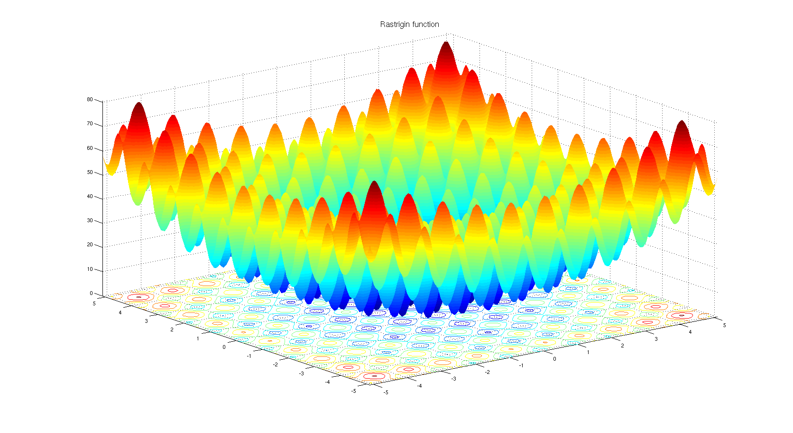

Covariance Matrix Adaptation - Evolutionary Strategy (CMA-ES)
=======================
* Inspired by David Ha's [A Visual Guide to Evolution Strategies](http://blog.otoro.net/2017/10/29/visual-evolution-strategies) 
to implement the CMA-ES optimization algorithm.

* [Official python implementation](https://github.com/CMA-ES/pycma)
* [Original paper from 2001](http://www.cmap.polytechnique.fr/~nikolaus.hansen/cmaartic.pdf)
	* This is what I used to hack out the core algorithm


## Surface Plot of Rastrigin Function

```python
def rastrigin(X, A=10):
    return A + np.sum((X**2 - A * np.cos(2 * np.pi * X)), -1)
```
## The Core Algorithm

* Evaluate the function on the sampled points X
	* d is the dimentions of the optimization space
	* n is the population size

```python
    X = np.random.normal(0,1.24, (d, n))
	fitness = function(X.T)
```
* Calculate the covariance matrix of top k samples, but centered
using the mean of the entire population
	* k is the size of the elite population
```python
	arg_topk = np.argsort(fitness)[:k]
	topk = X[:,arg_topk]

	centered = topk - X.mean(1, keepdims=True)
    C = (centered @ centered.T)/(k-1)
```
* Sample the new population for the next iteration from this covariance
matrix using the mean of the top k
```python

	w, E = la.eigh(C)
	N = np.random.normal(size=(d,n))
	X = topk.mean(1,keepdims=True) + (E @ np.diag(np.sqrt(w)) @ N)
```
* Repeat!


### Initialization:
```
n = 100     # Population size
d = 2       # Dimensions
k = 25      # Size of elite population

# Initial random sample
X = np.random.normal(0,1.24, (d, n))
```
